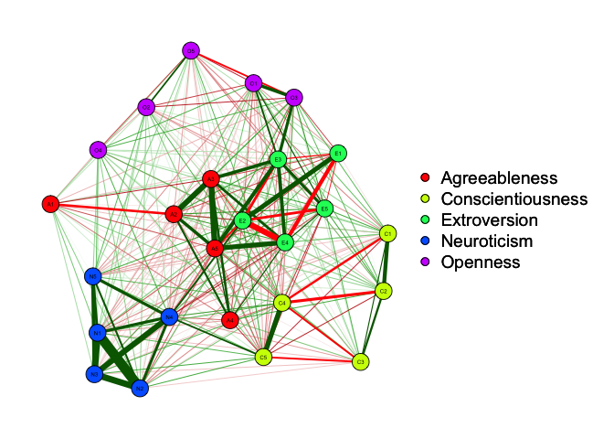

# Hello World - testing Markdown with Github
Markus  
22 November 2017  

```r
library(qgraph)
library(psych)
cor.bfi.home <- cor_auto(bfi[,1:25])
```

```
## Variables detected as ordinal: A1; A2; A3; A4; A5; C1; C2; C3; C4; C5; E1; E2; E3; E4; E5; N1; N2; N3; N4; N5; O1; O2; O3; O4; O5
```

```r
cor.bfi.home.round5 <- round(cor.bfi.home,5)
groups <- c(rep("Agreeableness",5), rep("Conscientiousness", 5), rep("Extroversion", 5), rep("Neuroticism", 5), rep("Openness", 5))
home.qg <- qgraph(cor.bfi.home.round5, layout="spring", groups = groups, vsize = 3)
```

<!-- -->

```r
home.layout <- home.qg$layout
```

